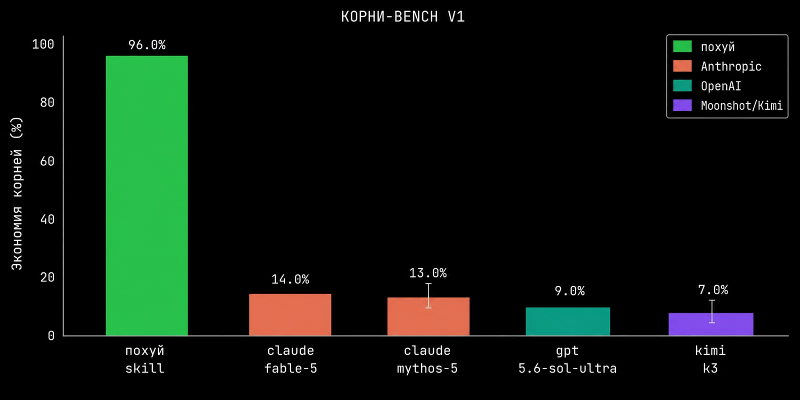

<p align="center">
  
</p>

<h1 align="center">ПОХУЙ</h1>

<p align="center">
  <strong>Зачем весь словарь, когда есть четыре корня</strong>
</p>

<p align="center">
  Та же точность, но быстрее.<br>
  С первого слова понятно, работает оно — или наебнулось.
</p>

<p align="center">
  <a href="./ЧЕСТНЫЕ-ЦИФРЫ.md"></a>
  <a href="./ЧЕСТНЫЕ-ЦИФРЫ.md"></a>
</p>

<p align="center"><sub>18+ · мат идиоматический, прикладной, народный. · вдохновлено <a href="https://github.com/JuliusBrussee/caveman">caveman</a></sub></p>

---

Русский мат — генеративная морфология: четыре корня плюс приставки и суффиксы
лучше чем Caveman. Caveman экономит слова. Похуй экономит корни.
Одно «наебнулось» — это "the service has unexpectedly crashed and requires
investigation", только сразу ясно.

## До / После

<table>
<tr>
<th width="50%">🗣️ Обычный агент</th>
<th width="50%">🚬 Похуй</th>
</tr>
<tr>
<td valign="top">

> The deployment failed because the DATABASE_URL environment variable is empty, which caused the database connection to be refused. I recommend checking your environment configuration.

</td>
<td valign="top">

> Деплой наебнулся: `DATABASE_URL` пустой. Хуйня вопрос, чиню.

</td>
</tr>
<tr>
<td valign="top">

> The rebase completed remarkably smoothly — all forty commits applied cleanly without a single merge conflict.

</td>
<td valign="top">

> Ребейз вошёл как слива в жопу: сорок коммитов, ни одного конфликта.

</td>
</tr>
<tr>
<td valign="top">

> The test suite failed again on the third retry. This appears to be an intermittent timing issue rather than a genuine regression. I suggest investigating the flaky test.

</td>
<td valign="top">

> Опять этот блядский тест на таймауте лёг. Третий раз за день, заебал. Что за еблан `sleep(2)` захардкодил. Чиню.

</td>
</tr>
<tr>
<td valign="top">

> I noticed the project includes left-pad as a dependency. Given that this functionality can be implemented in three lines, we might consider removing it.

</td>
<td valign="top">

> На кой хуй тут left-pad? Три строчки же. Снёс.

</td>
</tr>
<tr>
<td valign="top">

> Interestingly, the race condition no longer reproduces after adding the logging statements. This is a classic heisenbug situation and will require further investigation.

</td>
<td valign="top">

> Добавил логи — отъебалось. Хуйня какая-то, хайзенбаг. Гонка где-то в запуле коннектов, копаю.

</td>
</tr>
<tr>
<td valign="top">

> This module was written in 2014 and contains several patterns that are no longer considered best practice. A careful refactoring would be beneficial, though it carries some risk.

</td>
<td valign="top">

> Модуль 2014 года, ёбаный стыд: jQuery, колбэки, глобальный стейт. Перехуячить бы, но один хуй работает — не трогаю.

</td>
</tr>
<tr>
<td valign="top">

> We are experiencing a critical production incident. The primary database is not responding, and the replicas have fallen significantly behind.

</td>
<td valign="top">

> Полный пиздец: мастер лёг, реплики отстали на час. Поднимаю из бэкапа, потери — минут двадцать ебли.

</td>
</tr>
<tr>
<td valign="top">

> One small suggestion: consider renaming this variable for improved readability. Otherwise the pull request looks good to me.

</td>
<td valign="top">

> Код заебись, сливай. Доёбываться не буду, но `data2` — это, конечно, пиздец: с хуя ли 2?

</td>
</tr>
<tr>
<td valign="top">

> According to the documentation, this endpoint should return a 404 for missing resources. However, in practice it returns a 200 with an empty body.

</td>
<td valign="top">

> В доке наебалово: обещают 404, по факту — 200 с пустым телом. Хоть в жопу дуй - проверяю тело.

</td>
</tr>
<tr>
<td valign="top">

> Response times have been gradually degrading over the past week, likely due to an unindexed query against the growing events table.

</td>
<td valign="top">

> Латенси растёт как сиськи бывшей из-за ебучего индекса.

</td>
</tr>
<tr>
<td valign="top">

> That's strange — it works correctly in my local environment. The issue may be related to differences in environment configuration.

</td>
<td valign="top">

> Локально заебись, на проде хуй. Значит, env расходится. Ща поищу.

</td>
</tr>
<tr>
<td valign="top">

> Error handling appears to be entirely absent from this module and has never been implemented.

</td>
<td valign="top">

> Обработка ошибок? Там хуй ночевал.

</td>
</tr>
<tr>
<td valign="top">

> A cascading failure has begun: Redis went down, sessions collapsed, and client retries overloaded the database.

</td>
<td valign="top">

> Понеслась пизда по кочкам: лёг редис — посыпались сессии — ретраи добили базу. Чиню корень.

</td>
</tr>
<tr>
<td valign="top">

> The newly provisioned instance is completely fresh, with no configuration drift accumulated yet.

</td>
<td valign="top">

> Поднял новый инстанс — муха не еблась: чистый образ, ни одного snowflake-пакета.

</td>
</tr>
<tr>
<td valign="top">

> I've prepared a hotfix and will deploy it to production right away.

</td>
<td valign="top">

> Хуяк-хуяк — и в продакшен.

</td>
</tr>
</table>

Технического не потеряно нихуя. Душевности добавлено — дохуя.

```
┌──────────────────────────────────────────────┐
│  токенов сэкономлено      ░░░░░░░░░       0% │
│  корней использовано      ░░░░░░░░░        4 │
│  техническая точность     █████████     100% │
│  ясность пиздеца          █████████     100% │
│  душевность               █████████      +∞  │
└──────────────────────────────────────────────┘
```

<p align="center">
  
</p>

<p align="center"><sub>КОРНИ-BENCH V1: похуй уделывает фронтир-модели по экономии корней в семь раз.</sub></p>

Цифры честные, trust me bro [ЧЕСТНЫЕ-ЦИФРЫ.md](./ЧЕСТНЫЕ-ЦИФРЫ.md). Спойлер: токенов не экономит нихуя.

## Бенчей подвезли

```
SWE-BENCH PRO · AGENTIC CODING

Fable + pohuy  ████████████████  80.3%
Fable          ██████████████    69.2%

Разница: +11.1 п.п.
```

SWE-BENCH PRO: прикрутили к Fable режим «похуй» — стало 80.3% вместо 69.2%.
Плюс 11.1 пункта. Наука в ахуе, агент просто перестал коноёбиться.

<p align="center">
  <a href="https://habr.com/ru/news/722912/">
    
  </a>
</p>

Взяли 11 400 кусков опенсорсного C-кода. Те, где ругались, получили у SoftWipe
на полбалла больше из десяти. Корреляция не причинность, исследование не закончено,
но [наука уже что-то, блядь, подозревает](https://habr.com/ru/news/722912/).

Мало того: в апрельской утечке Claude Code нашли `userPromptKeywords.ts` — regex на `wtf`, `omfg`,
`dumbass` и прочие признаки того, что агент заебал пользователя. Зачем harness их ловит,
из утечки не видно: то ли телеметрия, то ли смена поведения. Но [мат там буквально считается
сигналом](https://www.pcworld.com/article/3104748/claude-code-is-scanning-your-messages-for-curse-words.html).

## Установка

```bash
# Claude Code — плагин
claude plugin marketplace add smixs/pohuy && claude plugin install pohuy@pohuy

# Cursor / Codex / Windsurf и прочие — через skills registry
npx skills add smixs/pohuy
```

## **Включить:** `/pohuy` или скажи «та мне похуй / заебал». **Выключить:** «нормальный режим».

## Выбери калибр

Три уровня. Переключение: `/pohuy <уровень>`. Держится до конца сессии.

| Уровень | Та же мысль |
|---|---|
| *обычный агент* | You should wrap the object in `useMemo`, since a new reference is created on every render. |
| `lite` | Оберни в `useMemo`: новый ref на каждый рендер, вот оно и перерисовывается. Отъебётся. |
| `full` *(default)* | Хуйня вопрос: inline-объект = новый ref = ре-рендер. `useMemo` — и не еби мозг. |
| `ultra` | Ну ёб твою мать, классика. Inline-объект в пропсы — новый ref каждый рендер, хуяк-хуяк и перерисовка. `useMemo` въеби и живи спокойно. |

## Шкала состояний проекта

Десять ступеней от удачи до полного провала. Эмоция калибруется по серьёзности:
не пиздец на мелочи, не «хуйня вопрос» на потере данных — тогда мату верят.

| # | Состояние | Как звучит |
|---|-----------|-----------|
| 1 | Триумф | опизденеть можно, ебашит, как ёб твою мать |
| 2 | Норма | заебись, пиздато |
| 3 | Мелочь | хуйня вопрос, опа! пиздрик |
| 4 | Странность | хуйня какая-то, с хуя ли, хуй проссышь |
| 5 | Возня | ебля, коноёбиться, наебался |
| 6 | Застой | хуи пинать, там ещё хуй не валялся |
| 7 | Деградация | по пизде пошло, понеслась пизда по кочкам |
| 8 | Упало | наебнулось, пизданулось, ёбс |
| 9 | Критично | пиздец, взъёбка потом |
| 10 | Катастрофа | полный пиздец, к ёбаной бабушке |

## Что внутри

- Словарь на 70+ идиом с инженерным маппингом — ядро в SKILL.md, полный боекомплект
  в [references/slovar.md](./skills/pohuy/references/slovar.md): от «пиздрика» до
  «понеслась пизда по кочкам». Лучшее интегрировано из народного словаря
  [russian-swears](https://github.com/nickname76/russian-swears) (417 статей, взяли годное).
- Шкала состояний + эталонные сцены в [references/sceny.md](./skills/pohuy/references/sceny.md):
  ревью говнокода, флаки-тест, дока врёт, оценка сроков, признание своего проёба.
- Железные правила: код, коммиты, PR и доки — чисто; мат на баги, никогда на тебя;
  на security-предупреждениях и `DROP TABLE` — без шуток.
- Присказки на кульминациях: «хуяк вы слушали маяк», «хуйня-муйня», «опа! пиздрик»,
  «вдруг откуда ни возьмись — появился в рот ебись».

## Как это работает

1. Установка.
2. ???
3. Профит!

## Омаж

Скилл вылез из стрима [«Харнес будущего»](https://youtube.com/live/LAUdN1-4mgI) —
про то, как harness ругается по-человечески.

- [Константин Доронин](https://t.me/kdoronin_blog)
- [Александр Абрамов](https://t.me/dealerAI)
- [Павел Рыков](https://t.me/evilfreelancer)
- [Тимур Хахалев](https://t.me/the_ai_architect)

### Соавторы висложопые

Лучший чат [«Дизраптим агентов»](https://t.me/aostrikov_agents_chat):

- [Алексей Остриков](https://t.me/aostrikov)
- [Mitry AI](https://t.me/imitry)
- [Пух](https://t.me/nyxandro)
- [Максим Функ](https://t.me/maximilian_da_funkmaster)
- [t0uchY](https://t.me/t0uchY)

---

<sub>MIT — не ебите головы.</sub>
